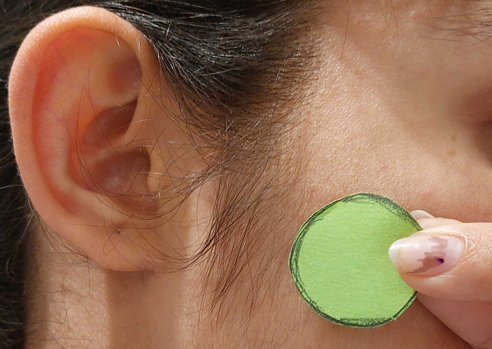
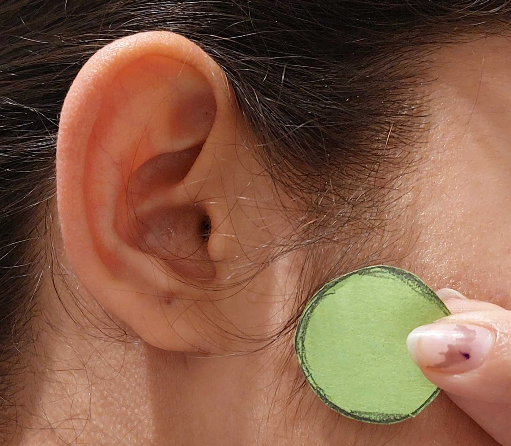

# ear-detection
Finding the distance between the top of the ear and the opening of the ear canal given a reference object.

## Initialization

After cloning the repo, make sure to install the following dependencies:

**OpenCV for Python:** 
~~~
pip install opencv-python
~~~

**Keras Tensorflow:**
~~~
pip install tensorflow
~~~

**Numpy and Matplotlib:**
~~~
pip install numpy
~~~
~~~
pip install matplotlib
~~~

## Input Image Requirements

The image used as the input should meet the following requirements for best results.

1. It should be cropped to contian just the ear and reference object. The ear should be at least one-fifth of the width of the image, and at least one half of the height. See the following examples for reference.  

    
    

2. The reference object should be a distinctive green circle with a diameter of 1 inch. (To change this requirement, read [below](#changing-the-reference-object).)

3. The resolution of the image should be at least 500px x 500px. 

## Running with Streamlit 

To run the project in your browser with [Streamlit](https://streamlit.io/), follow these steps: 
1. Install Streamlit using the instructions in Streamlit's [Installation Guide](https://docs.streamlit.io/library/get-started/installation).  
~~~
pip install streamlit
~~~
2. Make sure you're in the [`src/`](https://github.com/snykra/ear-detection/tree/master/src) directory and run 
~~~
streamlit run st-app.py
~~~
3. Open `http://localhost:8501/` in your browser. 

4. Upload a well-cropped image (see examples in [`src/images/input/`](https://github.com/snykra/ear-detection/tree/master/src/images/input) directory) and that's all! 

## Running without Streamlit

1. Copy your input image into the [`src/images/input/`](https://github.com/snykra/ear-detection/tree/master/src/images/input)directory.

2. Make sure you're in the [`src/`](https://github.com/snykra/ear-detection/tree/master/src) directory and run 
~~~
python3 main.py [your-filename]
~~~

## Training a new model

1. Download the data and labels from [here](##TODO). 

2. If you want to make changes to the model, edit [`src/model/train-model.py`](https://github.com/snykra/ear-detection/blob/master/src/model/train-model.py). Remember to update the name of the saved model to make sure pre-trained models are not overwritten. 

3. Change to the [`src/model`](https://github.com/snykra/ear-detection/tree/master/src/model) directory and run 
~~~
python3 train-model.py
~~~

4. Update the name of the model used to detect landmarks in the `find-landmarks()` function in [`src/utils.py`](https://github.com/snykra/ear-detection/blob/master/src/utils.py). 

## Changing the reference object

The reference object is found using the code in the `calculate-size-ratio()` function in [`src/utils.py`](https://github.com/snykra/ear-detection/blob/master/src/utils.py).

To **change the color** of the reference object, update the HSV color range, represented by the `lower` and `upper` variables, using this [answer](https://stackoverflow.com/a/48367205) as a reference.

To **change the dimensions**, update the `metric` variable.

## References

### Haar Cascades for Ear Detection
1. https://github.com/celiacintas/tests_landmarks/blob/master/files/cascade_lateral_ears_opencv.xml
2. https://github.com/shivangbansal/Haar-Cascade-Ear-Training

### CNN Model for Landmark Detection
1. Cintas, C., Quinto-Sánchez, M., Acuña, V., Paschetta, C., de Azevedo, S., Cesar Silva de Cerqueira, C., Ramallo, V., Gallo, C., Poletti, G., Bortolini, M.C., Canizales-Quinteros, S., Rothhammer, F., Bedoya, G., Ruiz-Linares, A., Gonzalez-José, R. and Delrieux, C. (2017), Automatic ear detection and feature extraction using Geometric Morphometrics and convolutional neural networks. IET Biom., 6: 211-223. https://doi.org/10.1049/iet-bmt.2016.0002

2. https://github.com/kbulutozler/ear-landmark-detection-with-CNN

